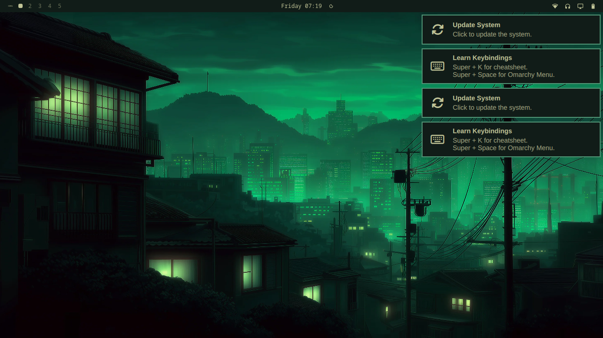

# Omarchy on the ClockworkPi uConsole

Running [Omarchy](https://github.com/basecamp/omarchy) — Hyprland, Quickshell, and
the whole Basecamp desktop — on a ClockworkPi uConsole with a Raspberry Pi
Compute Module 4, on Arch Linux ARM.



Omarchy targets x86_64 Arch. This documents what actually has to change to get it
onto aarch64 and this specific handheld, including three defects in the upstream
Arch image that will stop you dead if you do not know about them.

**Verified on:** uConsole with CM4 Rev 1.1 (4 GB), AIO V2 expansion board,
kernel `7.1.4-uconsole-cm4+`, Hyprland 0.56.1, Quickshell 0.3.1.

---

## Before you start

You need a CM4 **Lite**, or any Compute Module without onboard eMMC. Modules with
eMMC boot only from internal storage and cannot see the microSD slot at all. If
yours has eMMC you must flash it over USB with `rpiboot` instead, and everything
below still applies afterward.

You also need a second machine to prepare the card, and a microSD of 16 GB or more.

---

## Step 1: Flash the base image

Use the prebuilt Arch Linux ARM image from
[wdkdot/uconsole-arch](https://github.com/wdkdot/uconsole-arch). It ships the
uConsole-patched kernel with working display, backlight and battery drivers.

```bash
curl -LO https://github.com/wdkdot/uconsole-arch/releases/download/v2026.07.04/uconsole-arch-cm4.img.zst
zstd -d uconsole-arch-cm4.img.zst
```

Write it to the card, replacing `diskN` with your actual device. Check twice.

```bash
zstd -dc uconsole-arch-cm4.img.zst | sudo dd of=/dev/rdiskN bs=4m status=progress
```

Default login is `alarm` / `alarm`, root password `root`.

---

## Step 2: Fix the missing boot firmware

**This image will not boot as shipped.** Its boot partition contains the kernel,
initramfs, device trees and overlays, but no Raspberry Pi VideoCore firmware at
all. The CM4 bootloader loads `start4.elf` from the FAT partition before it can
start the ARM cores, so without it you get a green power LED and a black screen
that looks exactly like dead hardware.

The kernel package declares only `coreutils`, `kmod` and `mkinitcpio` as
dependencies, so nothing pulls the firmware in, and the image build script never
installs it either.

With the card still in your other machine, mount the `BOOT` partition and add it:

```bash
./scripts/fix-boot-firmware.sh /Volumes/BOOT
```

Or by hand:

```bash
for f in start4.elf fixup4.dat start4x.elf fixup4x.dat start4cd.elf fixup4cd.dat bootcode.bin; do
  curl -fsSL -o "/path/to/BOOT/$f" "https://raw.githubusercontent.com/raspberrypi/firmware/stable/boot/$f"
done
```

Eject, insert, and it boots.

---

## Step 3: First boot

Log in as `alarm`. The image installs `sudo` but never configures it, so `alarm`
cannot use it yet. Become root with `su -` (password `root`) and fix that:

```bash
usermod -aG wheel alarm && EDITOR=nano visudo   # uncomment the %wheel line
passwd && passwd alarm                           # change both passwords
```

Connect to Wi-Fi. NetworkManager is installed and enabled:

```bash
nmcli device wifi connect "YOUR_SSID" --ask
```

OpenSSH is enabled at boot, so grab the address and do everything else from a
real keyboard:

```bash
ip -4 addr show wlan0 | grep inet
```

---

## Step 4: Expand the filesystem

The image ships minimized with under 1 GB free, which is not enough for the
system upgrade, let alone a desktop.

```bash
sudo sfdisk -N 2 --force /dev/mmcblk0 <<< ", +"
sudo partx -u /dev/mmcblk0
sudo resize2fs /dev/mmcblk0p2
```

The warnings about the disk being in use and the kernel failing to re-read the
partition table are expected. `partx` handles it.

---

## Step 5: Work around the missing Landlock support

**Pacman will not run on this kernel.** Pacman 7 sandboxes downloads with
Landlock, and this kernel is not built with it:

```
error: restricting filesystem access failed because Landlock is not supported by the kernel!
```

Disable the sandbox:

```bash
grep -q '^DisableSandbox' /etc/pacman.conf || sudo sed -i '/^\[options\]/a DisableSandbox' /etc/pacman.conf
```

This puts pacman back to how it behaved before version 7. The cleaner long-term
fix is a kernel built with Landlock, such as
[OuinOuin74/linux-clockwork-arch](https://github.com/OuinOuin74/linux-clockwork-arch),
but that is a boot-critical swap.

---

## Step 6: Fix the clock, then the mirrors

The uConsole has no battery-backed clock by default, so it boots with a wrong
date and TLS fails against any mirror whose certificate is not yet valid.

```bash
sudo timedatectl set-ntp false
sudo timedatectl set-time "YYYY-MM-DD HH:MM:SS"
sudo timedatectl set-ntp true
sudo timedatectl set-timezone America/New_York   # your zone
```

The default `mirror.archlinuxarm.org` is a redirector that hands you a random
backend, and some of them truncate transfers repeatedly. Pin known-good ones:

```bash
sudo tee /etc/pacman.d/mirrorlist <<'EOF'
Server = http://fl.us.mirror.archlinuxarm.org/$arch/$repo
Server = http://nj.us.mirror.archlinuxarm.org/$arch/$repo
Server = http://ca.us.mirror.archlinuxarm.org/$arch/$repo
EOF
```

Do **not** set an `XferCommand` to work around flaky downloads. Pacman runs
external downloaders as the unprivileged `alpm` user, which cannot write to its
own sync directory, and you get permission errors instead.

---

## Step 7: Remove the stock kernel, then upgrade

The base rootfs carries `linux-aarch64`, the generic Arch ARM kernel. It is inert
because `config.txt` names the uConsole kernel explicitly, but upgrading it writes
a second kernel, initramfs and full device tree set into a 512 MB boot partition.
Drop it first.

Use plain `-R`. The `-s` flag cascades into removing `linux-firmware`, and the
uConsole kernel does not depend on it, so you would silently lose your Broadcom
Wi-Fi firmware.

```bash
sudo pacman -R linux-aarch64
sudo pacman -Syu
```

Reboot afterward, since both the kernel and systemd change.

---

## Step 8: The overlay rename

**After that kernel upgrade the screen goes black again.** The new kernel renamed
its device tree overlay from `clockworkpi-uconsole` to `clockworkpi-uconsole-cm4`,
but the shipped `config.txt` still asks for the old name. The overlay silently
fails to load, the panel never initializes, and the system boots normally in every
other respect. SSH keeps working, which is how you diagnose it.

```bash
sudo sed -i 's/^dtoverlay=clockworkpi-uconsole$/dtoverlay=clockworkpi-uconsole-cm4/' /boot/config.txt
sudo reboot
```

---

## Step 9: Enable compressed swap

4 GB of RAM is not much for building packages. Do this before the desktop install.

```bash
sudo pacman -S --needed zram-generator
sudo tee /etc/systemd/zram-generator.conf <<'EOF'
[zram0]
zram-size = ram
compression-algorithm = zstd
EOF
sudo systemctl daemon-reload
sudo systemctl start systemd-zram-setup@zram0.service
sudo systemctl start dev-zram0.swap
```

Note the second `systemctl start`. The setup service only creates and formats the
device; a separate swap unit activates it.

---

## Step 10: Install the desktop

**120 of Omarchy's 147 packages exist for aarch64, including `quickshell`**, which
drives its entire bar and shell. See [docs/package-status.md](docs/package-status.md)
for the full breakdown of what is missing.

```bash
sudo pacman -S --needed $(tr '\n' ' ' < scripts/desktop-packages.txt)
```

Around 409 packages and 566 MB, all prebuilt. Nothing is compiled.

This list deliberately omits LibreOffice, Kdenlive, OBS, Obsidian, Docker and the
printing stack. They cost gigabytes for things you will not open on a 5 inch
screen. Add them back if you disagree.

---

## Step 11: Deploy Omarchy

```bash
./scripts/deploy-omarchy.sh
```

This clones Omarchy to `/usr/share/omarchy`, links its ~440 commands into both
`/usr/bin` and `/usr/local/bin`, installs the profile and session files, and seeds
`~/.config`.

**Link into `/usr/bin`, not just `/usr/local/bin`.** Several Omarchy scripts call
siblings by absolute path, and they fail with "No such file or directory" otherwise.

Omarchy's terminal launcher needs `xdg-terminal-exec`, which has no ARM binary but
is architecture independent and builds in seconds:

```bash
git clone https://aur.archlinux.org/xdg-terminal-exec.git
cd xdg-terminal-exec && makepkg -si --noconfirm
cp /usr/share/omarchy/default/xdg-terminal-exec/hyprland-xdg-terminals.list ~/.config/xdg-terminals.list
```

Install a browser too, or every browser shortcut silently does nothing:

```bash
sudo pacman -S --needed chromium
xdg-settings set default-web-browser chromium.desktop
```

---

## Step 12: Panel rotation

The 5 inch DSI panel is natively 720x1280 portrait and physically mounted
landscape, so it needs a rotation transform. Copy [config/monitors.lua](config/monitors.lua)
to `~/.config/hypr/monitors.lua`.

```lua
hl.monitor({ output = "DSI-1", mode = "720x1280@60", position = "0x0", scale = 1, transform = 3 })
```

If the image is upside down, change `transform` to `1`.

Other guides use `monitor=,1280x720@60,0x0,1` with no transform. That assumes a
kernel where the panel reports landscape natively. On this one it does not.

---

## Step 13: No Super key

The uConsole keyboard has no Super/Windows key, and every Omarchy binding uses it.

Do **not** solve this with Hyprland's `kb_options`. Remap at the kernel input
layer with `keyd` so it applies in the console, in Hyprland, and in every
application at once:

```bash
sudo pacman -S --needed keyd
sudo cp config/keyd-default.conf /etc/keyd/default.conf
sudo systemctl enable --now keyd
```

Left Alt becomes Super, so every Omarchy shortcut works. Right Alt is untouched,
so Alt+Tab and menu shortcuts keep working.

If you also set `altwin:swap_lalt_lwin` in Hyprland, the two cancel out. Pick one.

---

## Step 14: Start the session

There is no display manager here on purpose. A greeter would need its own rotation
handling on this panel, which is one more thing to get wrong.

```bash
sudo mkdir -p /etc/systemd/system/getty@tty1.service.d
sudo tee /etc/systemd/system/getty@tty1.service.d/autologin.conf <<'EOF'
[Service]
ExecStart=
ExecStart=-/sbin/agetty -o "-p -f -- \\u" --noclear --autologin alarm %I $TERM
EOF
```

```bash
cat > ~/.bash_profile <<'EOF'
[[ -f ~/.bashrc ]] && . ~/.bashrc
if [[ -z $WAYLAND_DISPLAY && $XDG_VTNR == 1 ]]; then
  exec Hyprland &> ~/.local/share/hyprland-session.log
fi
EOF
```

Autologin means physical access is root-equivalent. Reasonable for a handheld,
your call.

---

## Step 15: Themes

All 22 Omarchy themes and their 92 backgrounds come with the repo clone.

```bash
omarchy-theme-set "Tokyo Night"
```

`OMARCHY_PATH` must be set or the command cannot find the theme directory. It is
exported by `/etc/profile.d/omarchy.sh` in login shells, but not over
non-interactive SSH.

---

## Step 16: Omarchy's own packages

**This is the part most ports miss.** Omarchy publishes PKGBUILDs for all 123 of
its packages at [omacom/omarchy-pkgs](https://github.com/omacom/omarchy-pkgs), and
every tool you are "missing" already declares `aarch64` in its recipe. Upstream
simply never publishes ARM binaries. They all build here.

```bash
./scripts/build-omarchy-pkgs.sh
```

That builds, in order:

| Package | Language | Notes |
|---|---|---|
| `ttfx` | Rust | Terminal effects. Powers the screensaver. ~9 min on a CM4 |
| `aether` | Go | Theming. Upstream ships an ARM64 binary; no compile |
| `herdr` | Rust | Agent runtime |
| `tensaku` | Rust | Needs GTK4 and libadwaita |
| `cliamp` | Go | Audio player |
| `omacalc`, `omacut`, `omawrite` | C++/Qt6 | The little Omarchy apps |
| `omarchy-nvim` | any | Omarchy's Neovim config |
| `tobi-try` | any | Ruby |
| `yay` | Go | AUR helper |
| `tzupdate` | Rust | |
| `mise-bin` | prebuilt | Version manager |
| `ttf-ia-writer`, `yaru-icon-theme` | any | Assets |

Skip `ttf-jetbrains-mono-nerd-basic`; the official repos have the full
`ttf-jetbrains-mono-nerd`, which is the same typeface.

`ufw-docker` is left out because it pulls in Docker.

---

## Step 17: The screensaver

Omarchy's screensaver calls `ttfx`, and on a fresh ARM install you get the console
flooded with `ttfx: command not found`.

It is easy to assume this is unfixable. It is not. `ttfx` is open source at
[omacom/ttfx](https://github.com/omacom/ttfx) — a Rust port of
[terminaltexteffects](https://github.com/ChrisBuilds/terminaltexteffects) with all
37 effects, byte-identical output to the Python original. It just has no published
ARM binary.

Do not try to substitute another program for it. The screensaver polls with
`pgrep -x ttfx`, which matches on process name, so a wrapper script around a
different binary leaves the loop spinning forever. Building the real thing is both
easier and correct.

It comes from Step 16 above, or build it directly:

```bash
git clone https://github.com/omacom/ttfx.git && cd ttfx
cargo build --release
sudo install -Dm755 target/release/ttfx /usr/local/bin/ttfx
```

Then seed the branding text it renders, which is not created for you:

```bash
mkdir -p ~/.config/omarchy/branding
cp /usr/share/omarchy/logo.txt ~/.config/omarchy/branding/screensaver.txt
```

Timings live in `~/.config/omarchy/shell.json`:

```json
"idle": { "screensaver": 150, "lock": 600 }
```

If you ever do want it off, use a large number rather than `0`. Zero reads as an
immediate timeout, not "disabled".

---

## Security tooling

Optional. See [docs/security-tools.md](docs/security-tools.md) for a lean set of
standard Arch packages that covers most of what people reach for Kali to get,
without the 2500-package metapackage.

---

## AIO V2 expansion board

See [docs/aio-v2.md](docs/aio-v2.md) for the full setup. Short version: everything
works except the RJ45 and USB 3.0, which need the separate CM5 upgrade kit.

The onboard real time clock is worth doing first — it permanently fixes the wrong
clock problem from Step 6.

---

## Credits

- [wdkdot/uconsole-arch](https://github.com/wdkdot/uconsole-arch) — the base image and kernel packaging
- [ak-rex/ClockworkPi-linux](https://github.com/ak-rex/ClockworkPi-linux) — the uConsole kernel
- [OuinOuin74/linux-clockwork-arch](https://github.com/OuinOuin74/linux-clockwork-arch) — alternative kernel, has Landlock
- [basecamp/omarchy](https://github.com/basecamp/omarchy) — Omarchy itself
- [hackergadgets/aiov2_ctl](https://github.com/hackergadgets/aiov2_ctl) — AIO V2 control tool
- [PotatoMania](https://github.com/PotatoMania/uconsole-cm3-arch-image-builder) and [PeterCxy](https://typeblog.net/61092/arch-linux-arm-on-clockworkpi-uconsole-w-rpi-cm5-and-swaywm) — earlier Arch-on-uConsole work

## License

MIT
